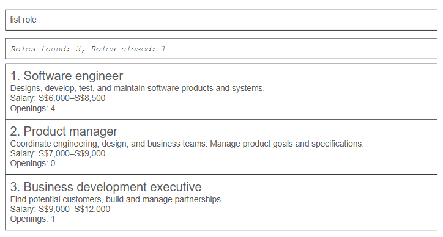

# RecruiterBuddy

RecruiterBuddy is a desktop application for department recruiters who are responsible for filling a small number of vacancies within one department. It helps recruiters maintain candidate details, track the open role associated with each candidate, record upcoming recruiter interviews, and monitor where each candidate stands in the recruitment process.

RecruiterBuddy combines a graphical interface with a command-driven workflow. It is optimised for recruiters who type quickly and prefer using keyboard commands to navigating a primarily mouse-driven interface. This allows recruiters to retrieve and update recruitment records efficiently throughout their workday.

## Planned MVP features

RecruiterBuddy is planned to support the following features:

* **Candidate management:** Add, list, and remove candidates. Each candidate is associated with exactly one open role and has a name, phone number, email address, and address. Candidate notes, tags, and recruiter interview details can also be recorded.
* **Recruitment status tracking:** Assign each candidate exactly one status from `PENDING_RESUME_SCREENING`, `PENDING_RECRUITER_INTERVIEW`, `PENDING_OFFER_EXTENSION`, `PENDING_OFFER_DECISION`, `HIRED`, `REJECTED`, or `WITHDRAWN`.
* **Duplicate prevention:** Prevent candidates with duplicate email addresses or phone numbers from being added.
* **Interview tracking:** Record or reschedule a candidate's recruiter interview date and time.
* **Role management:** Add and list role openings, including their titles and required experience levels. Each role represents exactly one vacancy and has either an `OPEN` or `CLOSED` status.
* **Role closure:** Close a role when recruitment has ended while retaining its existing candidate records and preventing new candidates from being added to it.
* **Command guidance:** View a guide covering the purpose, format, and examples of supported commands.
* **Data persistence:** Save changes automatically and restore saved candidate and role data when RecruiterBuddy starts.

RecruiterBuddy focuses on tracking candidates and role openings within a department. It does not manage internal HR matters such as payroll, leave, or employee benefits. It also does not communicate with candidates or hiring managers, process resumes, or automatically assess whether candidates are suitable for a role.

For detailed documentation, refer to the [User Guide](docs/UserGuide.md) and [Developer Guide](docs/DeveloperGuide.md).

## Acknowledgements

* This project is based on the [AddressBook-Level3](https://se-education.org/addressbook-level3/) project created by the [SE-EDU initiative](https://se-education.org).
* Libraries used: [JavaFX](https://openjfx.io/), [Jackson](https://github.com/FasterXML/jackson), and [JUnit5](https://github.com/junit-team/junit5).
